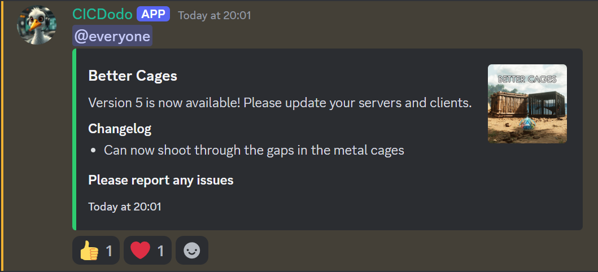

# CurseForge Discord Bot Manager

Desktop-managed Discord bot for tracking CurseForge mod releases and posting update announcements to Discord.

This is my fork of CICDodo, adapted for my own modding workflow. The original bot focused on monitoring CurseForge projects and announcing new releases. This version adds a Windows manager UI, per-game/per-mod Discord routing, easier tracked-mod management, release testing tools, and basic stats for the mods being followed.

Original project: [jordan-dalby/CICDodo](https://github.com/jordan-dalby/CICDodo)



## What It Does

- monitors configured CurseForge project IDs for new files
- posts release announcements to Discord channels
- can route announcements by mod, by game, or by the original mod/channel order
- supports global, per-game, and per-mod mention tags
- stores already-announced versions so releases are not posted twice
- lets you mark which configured mods are currently followed
- resolves mod names, authors, game names, downloads, likes, CurseForge links, and stored versions
- includes buttons for setup, start, stop, restart, one-time checks, and test messages
- lets you add or remove tracked mods from the UI by MOD_ID or by searching CurseForge
- can send the latest release for a selected mod to debug or release channels
- opens public CurseForge pages, author file pages, comments, logs, and project folder

## Quick Start

1. Install Python 3.11 or newer.
2. Copy `.env.example` to `.env`.
3. Fill in your Discord bot token, CurseForge API key, Discord channel IDs, and mod IDs.
4. Double-click `CurseForge Discord Bot Manager.vbs`.
5. Press `Setup` once to create the virtual environment and install dependencies.
6. Press `Start` to run the bot.

The `.env` file and `.local/` runtime folder are ignored by git. `.local/` contains the virtual environment, logs, release database, PID file, and manager window state.

## Configuration

Required values:

```env
BOT_TOKEN=your_discord_bot_token_here
CURSEFORGE_API_KEY=your_curseforge_api_key_here
DEBUG_CHANNEL_ID=123456789012345678
MOD_IDS=123456,789012
RELEASES_CHANNEL_IDS=123456789012345678,123456789012345679
```

Optional routing:

```env
FOLLOWING_MOD_IDS=123456,789012
GAME_RELEASE_CHANNEL_IDS=83374:123456789012345678;264710:123456789012345679
MOD_RELEASE_CHANNEL_IDS=123456:123456789012345678
MESSAGE_TAG=@everyone
GAME_MESSAGE_TAGS=83374:<@&123456789012345678>
MOD_MESSAGE_TAGS=123456:<@&123456789012345678>
```

`MOD_RELEASE_CHANNEL_IDS` has priority over `GAME_RELEASE_CHANNEL_IDS`. If neither exists for a mod, the bot falls back to the channel at the same index in `RELEASES_CHANNEL_IDS`, then to the first release channel.

`MOD_MESSAGE_TAGS` has priority over `GAME_MESSAGE_TAGS`. If neither exists, the bot uses `MESSAGE_TAG`.

Other useful values:

```env
MESSAGE_HEADER=New version available on CurseForge.
MESSAGE_FOOTER=Links
SHOW_LOGO=true
LOGO_STYLE=thumbnail
ANNOUNCE_MESSAGES=true
ADD_REACTIONS=true
CHECK_INTERVAL_MINUTES=5
LOG_LEVEL=INFO
DEBUG=false
MESSAGE_CONTENT_INTENT=false
```

## Manager UI

The manager is the intended way to use this fork locally.

It can create the Python environment, start/stop the bot, run a one-time update check, send test messages, inspect logs, manage tracked mods, toggle following state, set per-mod overrides, and review stored versions.

The UI saves its own window placement and sort/tab preferences locally under `.local/`, so those files do not pollute the repository.

### Sidebar

The sidebar shows the current process and runtime state:

- whether the bot is running or stopped
- current bot PID
- virtual environment status
- log file status
- release database status
- latest check activity
- latest release notification
- latest error
- tracked/followed mod counts

Use the sidebar actions for the day-to-day workflow:

- `Setup`: creates `.local/.venv` and installs Python dependencies
- `Start`: starts the Discord bot in the background
- `Stop`: stops the running bot
- `Restart`: restarts the bot after config changes
- `Check Now`: runs one release check immediately
- `Test Debug`: sends a debug test message
- `Test Release`: sends the latest release notification as a test
- `Open Log`: opens the current log file
- `Open Folder`: opens the project folder

The app prevents duplicate manager windows. Opening the launcher again closes the previous manager window and keeps a single active instance.

### Logs

The `Logs` tab shows the latest bot log output. It is useful for checking API errors, Discord permission issues, release detection, and background task output without opening the log file manually.

### Activity

The `Activity` tab shows output from manager actions such as setup, start, stop, restart, one-time checks, tests, adding mods, removing mods, and failed operations.

### Releases

The `Releases` tab is the main workspace for tracked mods.

From here you can:

- refresh tracked release data
- send the latest stored release for a selected mod to the release channel
- send the latest stored release for a selected mod to the debug channel
- add a mod directly by `MOD_ID`
- search CurseForge by mod name and add a selected result
- remove a selected mod from tracking
- toggle whether a mod is currently followed
- see the author for tracked mods, including projects that are not yours
- sort the table by clicking column headers
- drag tracked-mod columns to reorder them
- right-click a header to choose which columns are visible
- right-click a mod row to copy IDs, open pages, edit overrides, or inspect stored versions

Adding by `MOD_ID` is the most reliable path for private, unlisted, or not-yet-indexed projects. Search depends on what the CurseForge API returns for your API key.

Per-mod overrides have priority over per-game defaults. Use them when one specific mod should announce to a different channel or use a different message tag.

### Settings

The `Settings` tab edits the most important `.env` values from the UI.

It includes:

- global message tag
- debug channel ID
- check interval
- announcement toggle
- reaction toggle
- per-game release channel defaults
- per-game message tags

The `Per-game defaults` section is generated from the games detected in your currently tracked mods. It is not a fixed hardcoded list. When the app detects a new CurseForge `gameId` from a tracked mod, that game can appear there after refresh.

### Stats

The `Stats` tab is a compact view for author-facing mod stats and links.

It shows downloads, likes, stored versions, update dates, and quick access to comments. Columns can be sorted, so it is useful for checking which followed projects have the most activity or which ones were updated recently.

### Screenshot Notes

The README currently includes one manager screenshot. More screenshots can be added later for:

- the main dashboard/sidebar
- the Releases tab with tracked mods
- the CurseForge search dialog
- the Settings tab with per-game defaults
- the Stats tab

Place screenshots under `docs/screenshots/` and reference them from this README.

## Notes

This is not a polished general-purpose product. It is a practical tool built around my Discord/mod publishing workflow, but it should be configurable for other CurseForge release-monitoring setups.

The Discord bot itself needs permission to send messages in the configured channels. If you want command message content access, enable the Discord message content intent and set `MESSAGE_CONTENT_INTENT=true`.
