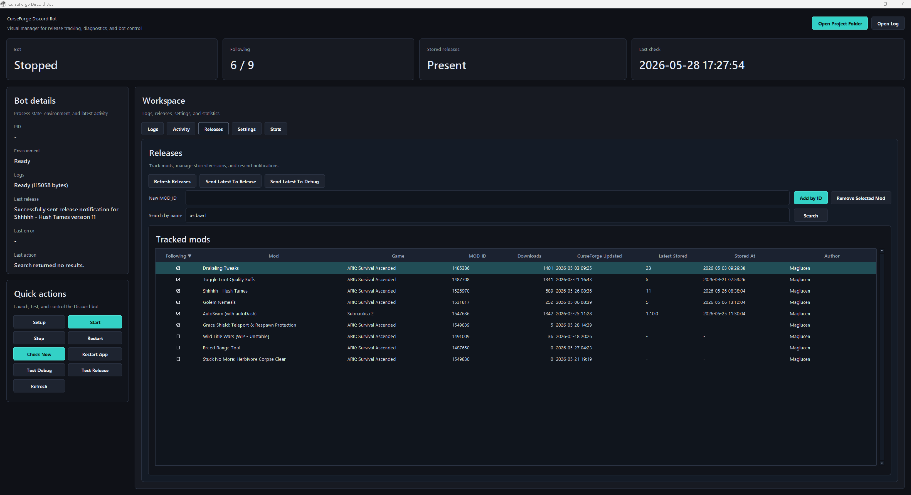
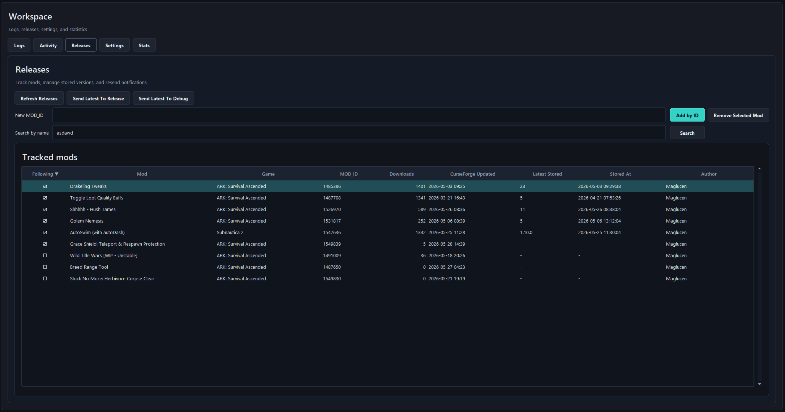
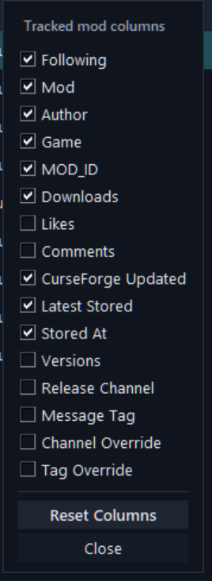
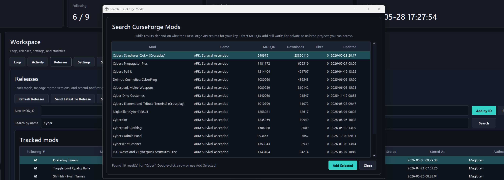
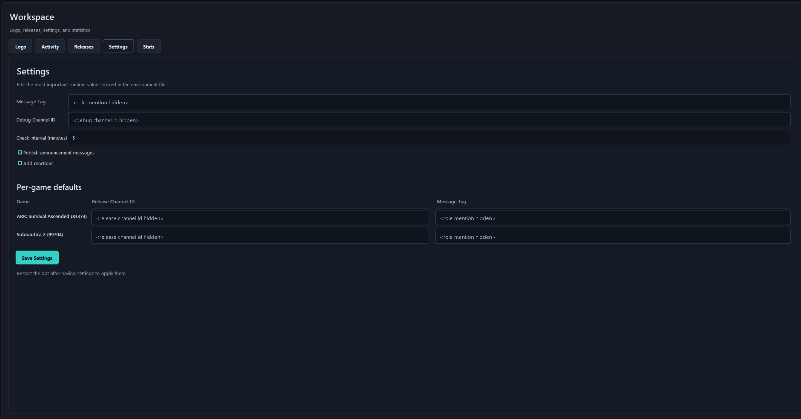
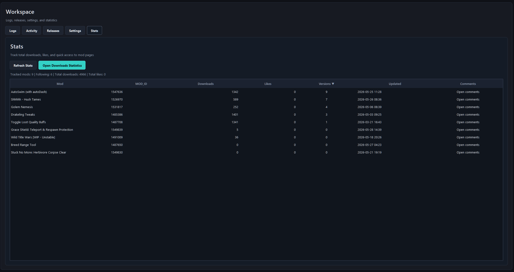
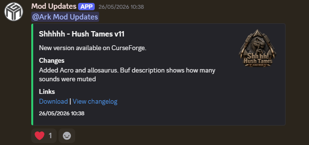

# CurseForge Discord Bot Manager

Desktop-managed Discord bot for tracking CurseForge mod releases and posting update announcements to Discord.

This is my fork of CICDodo, adapted for my own modding workflow. The original bot focused on monitoring CurseForge projects and announcing new releases. This version adds a Windows manager UI, per-game/per-mod Discord routing, easier tracked-mod management, Discord-style release previews, release testing tools, and basic stats for the mods being followed.

Original project: [jordan-dalby/CICDodo](https://github.com/jordan-dalby/CICDodo)



## What It Does

- monitors configured CurseForge project IDs for new files
- posts release announcements to Discord channels
- can route announcements by mod, by game, or by the original mod/channel order
- supports global, per-game, and per-mod mention tags
- previews release messages in a Discord-like embed before sending
- adds optional reactions to release messages
- stores already-announced versions so releases are not posted twice
- lets you mark which configured mods are currently followed
- resolves mod names, authors, game names, downloads, likes, CurseForge links, and stored versions
- includes buttons for setup, start/stop, restart, one-time checks, validation, refresh, and test messages
- lets you add or remove tracked mods from the UI by MOD_ID, or by searching CurseForge by mod name or author
- can send the latest release for a selected mod to debug or release channels
- can reset the local tool state and restore `.env` backups
- opens public CurseForge pages, author file pages, comments, logs, and project folder

## Quick Start

1. Install Python 3.11 or newer.
2. Double-click `CurseForge Discord Bot Manager.lnk`.
3. Press `Setup` once to create `.env` from `.env.example`, create the virtual environment, and install dependencies.
4. Fill in your Discord bot token, CurseForge API key, Discord channel IDs, and mod IDs in `Settings` or `.env`.
5. Press `Validate Config` to check the required values.
6. Press `Start Bot` to run the bot.

The launcher shortcut uses `tools/CurseForge Discord Bot Manager.vbs`. The script is kept in `tools/` so the project root can stay focused on the shortcut and source files.

The `.env` file and `.local/` runtime folder are ignored by git. `.local/` contains the virtual environment, logs, release database, PID file, and manager window state.

## Configuration

Required values:

```env
BOT_TOKEN=your_discord_bot_token_here
CURSEFORGE_API_KEY=your_curseforge_api_key_here
DEBUG_CHANNEL_ID=123456789012345678
MOD_IDS=123456,789012
RELEASES_CHANNEL_IDS=123456789012345678,123456789012345679
```

The checked-in `.env.example` intentionally leaves IDs blank. `Setup` copies it to `.env` when `.env` does not exist, then the manager can edit the most important values from the `Settings` tab.

Optional routing:

```env
FOLLOWING_MOD_IDS=123456,789012
GAME_RELEASE_CHANNEL_IDS=83374:123456789012345678;264710:123456789012345679
MOD_RELEASE_CHANNEL_IDS=123456:123456789012345678
MESSAGE_TAG=@everyone
GAME_MESSAGE_TAGS=83374:<@&123456789012345678>
MOD_MESSAGE_TAGS=123456:<@&123456789012345678>
```

`MOD_RELEASE_CHANNEL_IDS` has priority over `GAME_RELEASE_CHANNEL_IDS`. If neither exists for a mod, the bot falls back to the channel at the same index in `RELEASES_CHANNEL_IDS`, then to the first release channel.

`MOD_MESSAGE_TAGS` has priority over `GAME_MESSAGE_TAGS`. If neither exists, the bot uses `MESSAGE_TAG`.

For message tags, entering a numeric Discord role ID in the manager is normalized to a Discord role mention (`<@&role_id>`). Raw Discord mentions such as `<@&role_id>`, `<@user_id>`, `@everyone`, and `@here` are also supported. Release sends allow role and everyone mentions.

Other useful values:

```env
MESSAGE_HEADER=New version available on CurseForge.
MESSAGE_FOOTER=Links
SHOW_LOGO=true
LOGO_STYLE=thumbnail
ANNOUNCE_MESSAGES=true
ADD_REACTIONS=true
CHECK_INTERVAL_MINUTES=5
LOG_LEVEL=INFO
DEBUG=false
MESSAGE_CONTENT_INTENT=false
```

`ADD_REACTIONS=true` adds the default heart reaction to sent release messages. `MESSAGE_CONTENT_INTENT=true` is only needed for legacy `!commands`; normal release monitoring and sending does not require it.

## Manager UI

The manager is the intended way to use this fork locally.

It can create the Python environment, start/stop the bot, run a one-time update check, send test messages, inspect logs, manage tracked mods, toggle following state, set per-mod overrides, and review stored versions.

The UI saves its own window placement and sort/tab preferences locally under `.local/`, so those files do not pollute the repository.

### Sidebar

The sidebar shows the current process and runtime state:

- whether the bot is running or stopped
- current bot PID
- virtual environment status
- log file status
- release database status
- latest check activity
- latest release notification
- latest error
- tracked/followed mod counts

Use the sidebar actions for the day-to-day workflow:

- `Setup`: creates `.env` when missing, creates `.local/.venv`, and installs Python dependencies
- `Start Bot` / `Stop Bot`: starts or stops the Discord bot in the background
- `Restart Bot`: restarts the bot after config changes
- `Check Now`: runs one release check immediately
- `Validate Config`: checks required `.env` values before starting
- `Test Debug`: sends a debug test message
- `Test Release`: sends the latest release notification as a test
- `Refresh Data`: reloads status, logs, and CurseForge release data in the manager UI
- `Open Log`: opens the current log file
- `Open Folder`: opens the project folder

The `Setup` button hides once the environment and `.env` are present. The app also prevents duplicate manager windows. Opening the launcher again closes the previous manager window and keeps a single active instance.

### Logs

The `Logs` tab shows the latest bot log output. It is useful for checking API errors, Discord permission issues, release detection, and background task output without opening the log file manually.

### Activity

The `Activity` tab shows output from manager actions such as setup, start, stop, restart, one-time checks, tests, adding mods, removing mods, and failed operations.

### Releases

The `Releases` tab is the main workspace for tracked mods.

From here you can:

- refresh tracked release data
- preview the Discord release message for a selected mod, or open an example preview when no mod is selected
- send the latest stored release for a selected mod to the release channel
- send the latest stored release for a selected mod to the debug channel
- add a mod directly by `MOD_ID`
- search CurseForge by mod name or author and add a selected result
- filter search results by detected game, or use `All games` for a global CurseForge search
- remove a selected mod from tracking from the row context menu
- toggle whether a mod is currently followed
- see the author for tracked mods, including projects that are not yours
- sort the table by clicking column headers
- drag tracked-mod columns to reorder them
- right-click a header to choose which columns are visible
- right-click a mod row to copy IDs, open pages, edit overrides, or inspect stored versions

Adding by `MOD_ID` is the most reliable path for private, unlisted, or not-yet-indexed projects. Search depends on what the CurseForge API returns for your API key.

Per-mod overrides have priority over per-game defaults. Use them when one specific mod should announce to a different channel or use a different message tag.



The tracked-mod columns are configurable from the header context menu.



The search dialog lets you find public CurseForge projects by mod name or author and add the selected result. When searching by author, the author column is hidden because the rows are already matched by author.



### Settings

The `Settings` tab edits the most important `.env` values from the UI.

It includes:

- global message tag
- debug channel ID
- check interval
- message header and footer text
- logo display style
- log level
- announcement toggle
- reaction toggle
- legacy Discord `!commands` message content intent toggle
- safe screenshot mode for hiding Discord IDs and mention tags
- per-game release channel defaults
- per-game message tags
- `.env` backup restore
- full local tool reset

The `Per-game defaults` section is generated from the games detected in your currently tracked mods. It is not a fixed hardcoded list. When the app detects a new CurseForge `gameId` from a tracked mod, that game can appear there after refresh.

`Safe screenshot mode` only changes what is displayed in the manager UI. It does not edit `.env`; it masks Discord IDs and mention tags so screenshots can be shared without leaking channel or role IDs.

Saving settings creates a `.env` backup under `.local/env-backups/` before modifying the file. `Restore Last Backup` reverts the latest backup. `Reset Tool` stops the bot, restores `.env` from `.env.example`, and clears local logs, release storage, PID, and saved UI state.



### Stats

The `Stats` tab is a compact view for author-facing mod stats and links.

It shows downloads, likes, stored versions, update dates, and quick access to comments. Columns can be sorted, so it is useful for checking which followed projects have the most activity or which ones were updated recently.



### Discord Output

Release announcements are posted as Discord embeds with the configured mention tag, changelog summary, links, timestamp, optional mod logo, and optional reaction.

The local preview window draws an approximate Discord message with the mention, embed, logo placement, links, and reaction. It is useful before sending, but the exact final rendering still depends on Discord. Use `Send Latest To Debug` to see the real message in Discord without posting to the release channel.



## Notes

This is not a polished general-purpose product. It is a practical tool built around my Discord/mod publishing workflow, but it should be configurable for other CurseForge release-monitoring setups.

The Discord bot itself needs permission to send messages in the configured channels. If you want command message content access, enable the Discord message content intent and set `MESSAGE_CONTENT_INTENT=true`.
